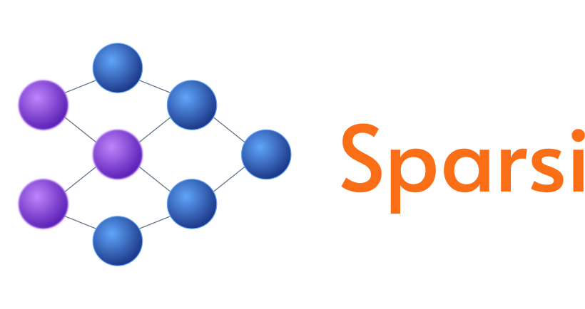

<p align="center">
  
</p>

[](https://pkg.go.dev/github.com/akennis/sparsi-go)
[](https://goreportcard.com/report/github.com/akennis/sparsi-go)

**Fewer tokens, lower latency, better results.** 

`sparsi-go` is a Go framework for building **deterministic-first AI workflows** and compiling them into high-performance [Model Context Protocol (MCP)](https://modelcontextprotocol.io/) servers.

---

## Why sparsi-go?

Today's agents are interpreters. They re-derive the same routines — classify, route, extract, reply — from scratch on every request, paying the reasoning cost in tokens, latency, and reliability.

**Sparsi is the build step they never had.** It lets you author repeating request types as DAG workflows that are:

*   **Deterministic by Default** — The graph is plain, testable Go. AI runs only where language understanding is strictly required.
*   **Modular Building Blocks** — Compose workflows from reliable, reusable components instead of "black box" prompts.
*   **Parallel by Architecture** — Independent branches run concurrently; speed comes from the graph's shape, not manual threading.
*   **Model Agnostic** — Pin different models to different steps. A cheap classifier here, a strong synthesizer there.
*   **Bounded & Auditable** — Fixed AI call counts and full reasoning traces for every step.

---

## Features

- **MCP First**: Every workflow can be served as a standard MCP tool via stdio or HTTP.
- **Rich Operator Library**: Built-in ops for Math, Strings, JSON, I/O, and advanced AI tasks.
- **AI-Assisted Repair**: Gracefully recover from LLM hallucinations with bounded retry loops.
- **RAG & Retrieval**: First-class support for retrieval-augmented generation with citation validation.
- **Hot-Reloadable MCP Pool**: Efficiently manage external tools like Playwright or sandboxed filesystems.

---

## Quick Start

The fastest way to build Sparsi workflows is using our bundled skills. They allow you to design and generate Go code automatically within your AI assistant.

### 1. Download the Skills
Download the latest bundle from [Releases](https://github.com/akennis/sparsi-go/releases).

### 2. Install the Skills
Copy the `sparsi-design` and `sparsi-codegen` directories to your assistant's skills folder:

**macOS / Linux:**
```bash
cp -r sparsi-design sparsi-codegen ~/.claude/skills/
```

**Windows (PowerShell):**
```powershell
Copy-Item -Recurse sparsi-design, sparsi-codegen "$env:USERPROFILE\.claude\skills\"
```

### 3. Start Designing
Invoke the design skill from your assistant with your task description:
```bash
/sparsi-design <your task here>
```

---

## Examples

Discover what you can build with Sparsi:

| Example | Highlights |
| :--- | :--- |
| [**Ticket Triager**](./examples/ticket-triager/) | Classification & structured routing. |
| [**Recipe Analyzer**](./examples/recipe-analyzer/) | Parallel extraction & Gemini integration. |
| [**Faithful Summary**](./examples/faithful-summary/) | Cross-model verification (Claude + Gemini). |
| [**RAG (BM25)**](./examples/rag-bm25/) | Retrieval-augmented Q&A with citation validation. |
| [**With Repair**](./examples/with-repair/) | AI-driven recovery from parse failures. |

[See all 12+ examples →](./examples/)

---

## Documentation

- [**Core Concepts**](./docs/concepts.md) — DAGs, Ops, and the Engine.
- [**Operator Library**](./docs/operators.md) — Exhaustive list of all built-in operators.
- [**Writing Workflows**](./docs/writing-workflows.md) — AI ops, Conditionals, and Map nodes.
- [**MCP Integration**](./docs/mcp.md) — Hosting your workflows as MCP servers.
